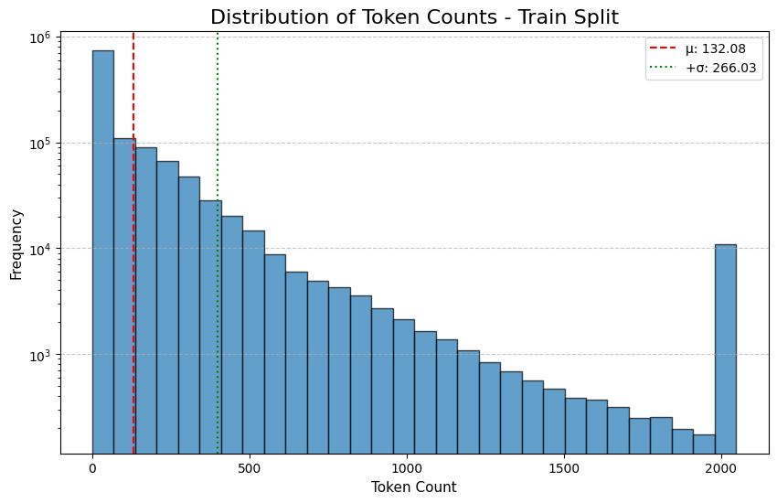
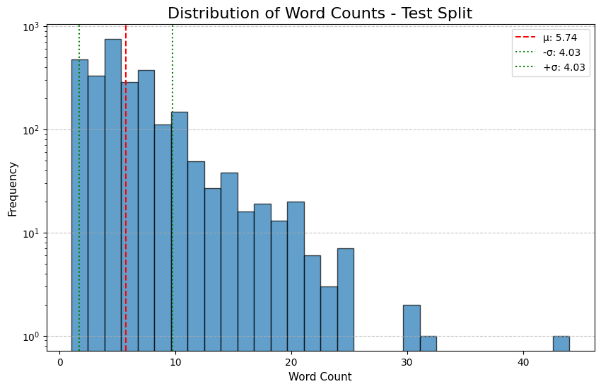
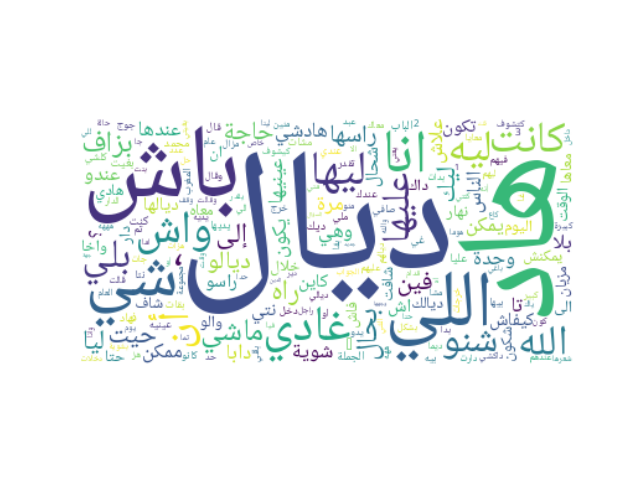
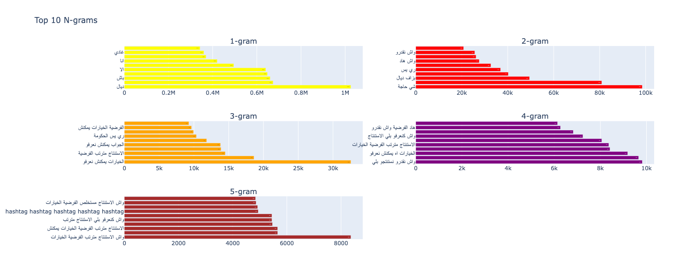
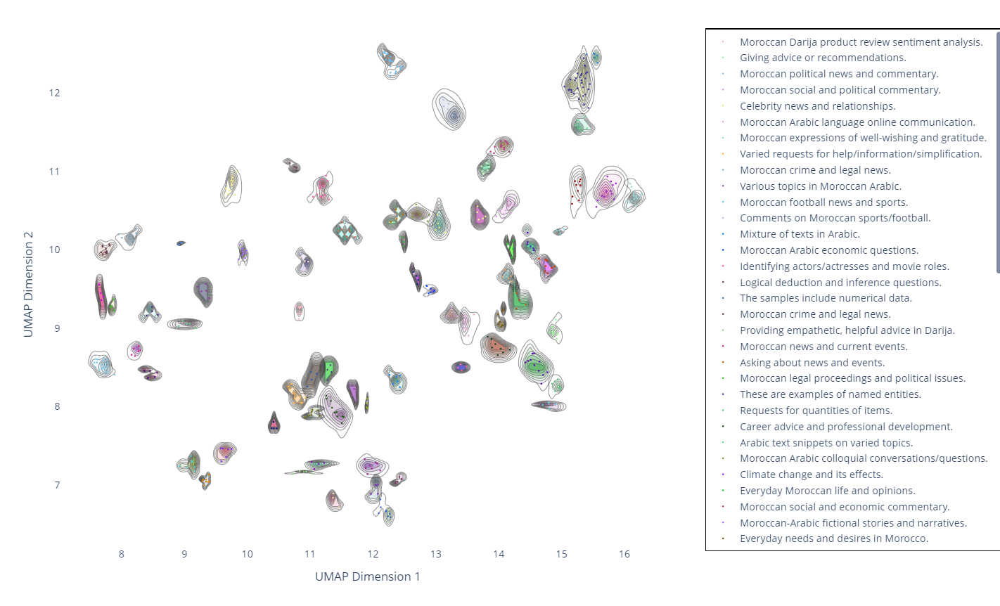

# Al-Atlas Pretraining Dataset for Moroccan Darija: Collection, Analysis, and Model Trainings

## TL;DR
We present a comprehensive dataset for Moroccan darija, addressing the lack of resources for this widely spoken dialect. We detail our collection methodology, provide thorough data analysis, and demonstrate performance improvements in both masked and causal language models after training on this dataset.
1. Try our **Causal Language Model** for Moroccan darija [on Hugging Face](https://huggingface.co/spaces/atlasia/Al-Atlas-LLM).
2. Try our **Masked Language Model** for Moroccan darija [on Hugging Face](https://huggingface.co/spaces/atlasia/Masked-LM-Moroccan-Darija).
2. Our [dataset on Hugging Face](https://huggingface.co/datasets/atlasia/AL-Atlas-Moroccan-Darija-Pretraining-Dataset).

## 1. Challenges in Moroccan Darija

Moroccan darija stands at a fascinating linguistic crossroads, embodying a rich tapestry of influences from Arabic foundations interwoven with Berber, French, and Spanish elements. This vibrant dialect, though widely spoken throughout Morocco, presents unique challenges in the computational linguistics domain. 

Unlike Modern Standard Arabic (MSA) and other well-resourced languages, Moroccan darija exists in a digital resource vacuum, with **no standardized writing system** to guide its representation. This **orthographic fluidity** where texts may appear in Arabic script, Latin characters, or creative hybridizations, creates significant hurdles for traditional Natural Language Processing (NLP) approaches. The dialect's natural tendency toward **code-switching** and **regional variations** further compounds these challenges, placing Moroccan darija squarely in the category of **under-resourced languages** despite its **cultural significance and widespread use** in daily Moroccan life.

These challenges create a significant barrier for developing AI applications for the millions of Moroccan darija speakers, highlighting the **need for dedicated resources** such as datasets, foundational models and NLP tools.

## 2. Data Collection: A Mother Dataset

We've assembled what we believe is the most complete collection of publicly available Moroccan darija text data. Our dataset incorporates every known public resource, creating a comprehensive pretraining corpus. We welcome community contributions to identify any overlooked or newly released datasets.

Beyond existing resources, we've carefully curated additional diverse content from multiple sources. The complete dataset includes text from:
- **Websites:** News portals, local forums, and cultural blogs.
- **Blogs:** Personal narratives and local storytelling platforms.
- **Social Media Posts:** Public posts providing colloquial expressions.
- **Other Potential Datasets:** Investigated existing resources related to Moroccan darija where available.

It is worth mentionning that an overlap between datasets have been observed in particular with [M-A-D/DarijaBridge](https://huggingface.co/datasets/M-A-D/DarijaBridge). These duplicates have been removed and we kept the original sources.

### Corpus Statistics

- Total size: 1.13 GB
- Total rows: 1.17M
- Total tokens (using [Jais-13B](https://huggingface.co/inceptionai/jais-13b) tokenizer):
    - For the training set: **155,501,098 tokens**.
    - For the test set: **19,187 tokens**.

## 3. Data Analysis

### Token and Word Metrics
The dataset shows a diverse range of text lengths. The figures below present the tokens and word count distributions, respectively.

### Visual Insights
To get a visual of the most frequent words and sequences of words (n-grams) in the dataset, we provide:
- **Word Cloud:** A visualization of the most frequent words in the dataset.

- **Top k n-grams:** Analysis of the most common n-grams to uncover linguistic patterns.

While the word cloud and lower-order n-grams (1-grams and 2-grams) effectively illustrate commonly used words in everyday speech, this pattern doesn't continue for higher values of $k > 2$. This discrepancy highlights a limitation in the current version of the dataset and represents an area for ongoing research and improvement.

### Topic Analysis
We now dive into a brief exploration of dominant topics across the dataset. We sample 1,000 elements and user BERTTopic along with DBSCAN for efficient clustering. The process is as follows:
1. We sampled `1,000` elements from the [Al-Atlas dataset](https://huggingface.co/datasets/atlasia/AL-Atlas-Moroccan-Darija-Pretraining-Dataset) (using `seed=1998`).
2. We computed embeddings using a specialized embedding model for Moroccan darija.
3. We used Uniform Manifold Approximation and Projection (UMAP) to reduce the dimension to $\mathbb{R}^2$.
4. We optimized DBSCAN's $\epsilon$ and `min_samples` parameters based on `silhouette_score`.
5. We plotted the results

<iframe src="https://www.atlasia.ma/al-atlas-blog/cluster.html" width="100%" height="500px"></iframe> 
<!--  -->

It turns out that the topics discussed ranges from Moroccan news and politics to climate change, sports, art, movies, Moroccan recepies and everday needs. 

Notably, this analysis was made possible by our embedding model, which effectively extracts relevant linguistic features. The model is a [Sentence Transformer](https://huggingface.co/sentence-transformers) built on top of the Masked Language Model detailed in the next section. Implementation details, evaluation metrics and technical specifications will be included in our next release.

## 4. Trainings

We train two different models, a Masked Language Model and a Causal Language Model.

### Masked Language Model

We selected [FacebookAI/xlm-roberta-large](https://huggingface.co/FacebookAI/xlm-roberta-large) as our base model due to its strong multilingual performance. We fine-tuned this model on the [Al-Atlas dataset](https://huggingface.co/datasets/atlasia/AL-Atlas-Moroccan-Darija-Pretraining-Dataset).

For the fine-tuning process, we used a total batch size of `128` and conducted learning rate optimization, testing values in the range `{1e-4, 5e-5, 1e-5}`. Our experiments revealed that training with a learning rate of 1e-4 yielded the best performances.

### Causal Language Model

For our causal language modeling approach, we chose **Qwen2.5** for its superior multilingual capabilities and robust baseline performance ([source](https://huggingface.co/spaces/HuggingFaceFW/blogpost-fine-tasks)). We focused on continual pretraining of the base [Qwen2.5-0.5B](https://huggingface.co/Qwen/Qwen2.5-0.5B) model variant, using the [Al-Atlas dataset](https://huggingface.co/datasets/atlasia/AL-Atlas-Moroccan-Darija-Pretraining-Dataset) with a context length of `2048`.

The model was fine-tuned with a total batch size of `128` and a learning rate of `1e-4`, which is generally recognized as an effective learning rate for Qwen2.5 models.

## 5. Evaluation

To validate whether training on the [Al-Atlas dataset](https://huggingface.co/datasets/atlasia/AL-Atlas-Moroccan-Darija-Pretraining-Dataset) provides meaningful improvements, we conducted a comprehensive human evaluation through a dedicated [Hugging Face space](https://huggingface.co/spaces/atlasia/Moroccan-Darija-LLM-Battle-Al-Atlas). The leaderboard results are summarized bellow:

### Masked Language Model Leaderboard

| Model | Wins | Total Comparisons | Win Rate (%) |
|-------|------|-------------------|--------------|
| [BounhaIAbdelaziz/XLM-RoBERTa-Morocco](https://huggingface.co/BounharAbdelaziz/XLM-RoBERTa-Morocco) | 72 | 120 | 60 |
| [aubmindlab/bert-base-arabertv02](https://huggingface.co/aubmindlab/bert-base-arabertv02) | 63 | 114 | 55.26 |
| [SI2M-Lab/DarijaBERT](https://huggingface.co/SI2M-Lab/DarijaBERT) | 55 | 119 | 46.22 |
| [FacebookAI/xlm-roberta-large](https://huggingface.co/FacebookAI/xlm-roberta-large) | 51 | 120 | 42.5 |
| [google-bert/bert-base-multilingual-cased](https://huggingface.co/google-bert/bert-base-multilingual-cased) | 29 | 120 | 24.17 |

### Causal Language Models Leaderboard

| Model | Wins | Total Comparisons | Win Rate (%) |
|-------|------|-------------------|--------------|
| [BounhaIAbdelaziz/Al-Atlas-LLM-0.5B](https://huggingface.co/BounharAbdelaziz/Al-Atlas-LLM-0.5B) | 105 | 120 | 87.5 |
| [MBZUAI-Paris/Atlas-Chat-2B](https://huggingface.co/MBZUAI-Paris/Atlas-Chat-2B) | 99 | 127 | 77.95 |
| [Qwen/Qwen2.5-0.5B](https://huggingface.co/Qwen/Qwen2.5-0.5B) | 19 | 130 | 14.62 |

### Results Analysis
The evaluation results revealed significant performance gains over the baseline models in both masked and causal language modeling approaches:

- **Causal Language Model**: Our Qwen2.5-0.5B model fine-tuned on the [Al-Atlas dataset](https://huggingface.co/datasets/atlasia/AL-Atlas-Moroccan-Darija-Pretraining-Dataset) demonstrated a **72.88%** performance improvement compared to the base model. Additionally, it has improved perplexity and contextual understanding across multiple prompts.

- **Masked Language Model**: Our fine-tuned [FacebookAI/xlm-roberta-large](https://huggingface.co/FacebookAI/xlm-roberta-large) model on the [Al-Atlas dataset](https://huggingface.co/datasets/atlasia/AL-Atlas-Moroccan-Darija-Pretraining-Dataset) showcases enhanced accuracy and fluency in understanding and generating Moroccan darija text. It has also showed a **17.5%** boost in performance compared to its baseline.

Perhaps most notably, our 0.5B parameter causal language model outperforms [MBZUAI-Paris/Atlas-Chat-2B](https://huggingface.co/MBZUAI-Paris/Atlas-Chat-2B) by almost **10%** demonstrating the effectiveness of targeted pretraining on high-quality, domain-specific data. This remarkable result shows how our model punches above its weight class, achieving superior performance with just a quarter of the parameters.

These findings validate the quality and utility of the [Al-Atlas dataset](https://huggingface.co/datasets/atlasia/AL-Atlas-Moroccan-Darija-Pretraining-Dataset) as a valuable resource for developing more effective Moroccan darija language models. The dramatic improvements highlight how specialized pretraining on dialectal data can significantly enhance performance, even when working with smaller model architectures.

## Conclusion

This project highlights the potential of leveraging a targeted pretraining dataset for Moroccan darija:
- We addressed linguistic challenges through **diverse data collection** and **meticulous pre-processing**.
- In-depth **data analysis** confirmed the richness and complexity of the dataset.
- **Training experiments** with both **masked and causal language models** revealed significant performance improvements compared to their baselines.
- Future work will extend this dataset with more resources and further fine-tuning on downstream tasks as well as a chat-based model.

## Acknowledgements

Many thanks to the vibrant research community behind Moroccan darija. Special thanks to [Hugging Face](https://huggingface.co/) for sponsoring our community and for providing such a great ecosystem for providing the tools and support necessary to conduct this research.
